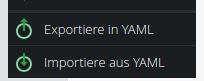

# Pimcore Import Export Bundle

## Installation

1. **Require the bundle**
   
   ```shell
   composer require teamneusta/pimcore-import-export-bundle
   ```

2. **Enable the bundle**
   
   Add the Bundle to your `config/bundles.php`:
   
   ```php
   Neusta\Pimcore\ImportExportBundle\NeustaPimcoreImportExportBundle::class => ['all' => true],
   ```

## Usage

After enabling the bundle you should see a new menu item in the context menu of Pimcore Admin Backend - Section
Documents:



(german translation)

### Page Export

The selected page will be exported into YAML format:

```yaml
page:
    id: 123
    parentId: 1
    type: page
    published: true
    path: /
    language: de
    navigation_name: my-site
    navigation_title: 'My Site'
    key: my-site
    title: 'My Site'
    controller: 'App\DefaultController::indexAction'
    editables:
        main:
            type: areablock
            name: main
            data: [ { key: '1', type: text-editor, hidden: false } ]
...
```  

In the same way you can re-import your yaml file again by selecting: `Import from YAML` in the context menu.

## Configuration

### Page Import

The import process will create pages with the given data.

The following rule applies:

If the parseYaml method of the `PageImporter` is not called with `forcedSave`, the data from the provided YAML will be
adopted, regardless of whether it makes sense or not, and without checking whether the page could be saved that way.

If `forcedSave` is set to `true`, the ID will be retained (Caution – this can overwrite an existing page).
If a `parentId` is specified, the corresponding document will be searched for.
If it exists, it will be set as the parent (Note: This may override the `path` specification).
If the `parentId` does not exist, an attempt will be made to find a parent using the `path` specification.
If such a parent exists, the `parentId` will be set accordingly and saved.

If neither is found, an InvalidArgumentException will be thrown, and the save operation will be aborted.

If multiple pages are imported and a path specification changes py the applied rules, this path specification will be
replaced with the new, correct path specification in all provided page configurations.

## Contribution

Feel free to open issues for any bug, feature request, or other ideas.

Please remember to create an issue before creating large pull requests.

### Local Development

To develop on your local machine, the vendor dependencies are required.

```shell
bin/composer install
```

We use composer scripts for our main quality tools. They can be executed via the `bin/composer` file as well.

```shell
bin/composer cs:fix
bin/composer phpstan
bin/composer tests
```
