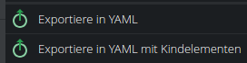
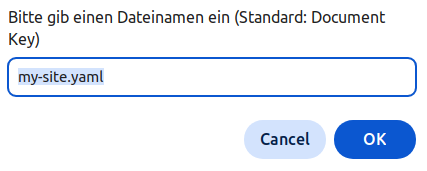
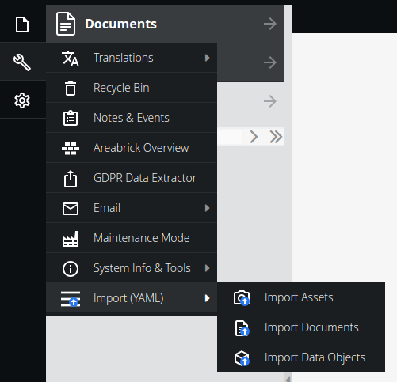

# Pimcore Import Export Bundle

## Installation

1.  **Require the bundle**
   
    ```shell
    composer require teamneusta/pimcore-import-export-bundle
    ```

2.  **Enable the bundle**

    Add the Bundle to your `config/bundles.php`:

    ```php
    Neusta\Pimcore\ImportExportBundle\NeustaPimcoreImportExportBundle::class => ['all' => true],
    ```

## Usage

### Pimcore Admin Backend

After enabling the bundle you should see a new menu item in the context menu of Pimcore Admin Backend - Section Documents:



After that you will be asked for a file name and the export will start:


(german translation)

For the import you can use the main menu button:



### Symfony Commands

There are two commands: one for exporting all pages, starting from the root document with ID 1, and one for importing pages from a given YAML file.

#### Export Command

##### Command Name
`neusta:pimcore:export:pages:all`

##### Description
Exports all pages into a single YAML file. Optionally, you can specify a comma-separated list of page IDs to export specific pages and their children.

##### Options

- `--output` or `-o` (optional): Specifies the name of the output file. Default is `export_all_pages.yaml`.
- `--ids` (optional): A comma-separated list of page IDs to export. If not provided, the command exports the root page and its children.

##### Usage

1. **Export all pages to the default file:**
   
   ```sh
   php bin/console neusta:pimcore:export:pages:all
   ```

2. **Export all pages to a specified file:**
   
   ```sh
   php bin/console neusta:pimcore:export:pages:all --output=custom_output.yaml
   ```

3. **Export specific pages and their children:**
   
   ```sh
   php bin/console neusta:pimcore:export:pages:all --ids=2,3,4
   ```

4. **Export specific pages and their children to a specified file:**
   
   ```sh
   php bin/console neusta:pimcore:export:pages:all --ids=2,3,4 --output=custom_output.yaml
   ```

##### Example

To export pages with IDs 2, 3, and 4 and their children to a file named `selected_pages.yaml`:

```sh
php bin/console neusta:pimcore:export:pages:all --ids=2,3,4 --output=selected_pages.yaml
```

This command will generate a YAML file named `selected_pages.yaml` containing the specified pages and their children. If any of the specified page IDs are not found, an error message will be displayed.
#### Import Command

##### Command Name
`neusta:pimcore:import:pages`

##### Description
Imports pages from a given YAML file. Optionally, you can perform a dry run to see how many pages would be successfully imported without actually saving them.

##### Options

- `--input` or `-i` (required): Specifies the name of the input YAML file.
- `--dry-run` (optional): Perform a dry run without saving the imported pages.

##### Usage

1. **Import pages from a specified file:**
   
   ```sh
   php bin/console neusta:pimcore:import:pages --input=your_input_file.yaml
   ```

2. **Perform a dry run to see how many pages would be imported:**
   
   ```sh
   php bin/console neusta:pimcore:import:pages --input=your_input_file.yaml --dry-run
   ```

##### Example

To import pages from a file named `pages_to_import.yaml`:

```sh
php bin/console neusta:pimcore:import:pages --input=pages_to_import.yaml
```

To perform a dry run for the same file:

```sh
php bin/console neusta:pimcore:import:pages --input=pages_to_import.yaml --dry-run
```

This command will read the specified YAML file and import the pages. If the `--dry-run` option is used, the pages will not be saved, and you will see how many pages would be successfully imported.

## Concepts

### Page Export

The selected page will be exported into YAML format:

```yaml
page:
    id: 123
    parentId: 1
    type: page
    published: true
    path: /
    language: de
    navigation_name: my-site
    navigation_title: 'My Site'
    key: my-site
    title: 'My Site'
    controller: 'App\DefaultController::indexAction'
    editables:
        main:
            type: areablock
            name: main
            data: [ { key: '1', type: text-editor, hidden: false } ]
...
```  

In the same way you can re-import your yaml file again by selecting: `Import from YAML` in the context menu.

### Page Import

The import process will create pages with the given data.

The following rule applies:

If the parseYaml method of the `PageImporter` is not called with `forcedSave`, the data from the provided YAML will be
adopted, regardless of whether it makes sense or not, and without checking whether the page could be saved that way.

If `forcedSave` is set to `true`, the ID will be retained (Caution – this can overwrite an existing page).
If a `parentId` is specified, the corresponding document will be searched for.
If it exists, it will be set as the parent (Note: This may override the `path` specification).
If the `parentId` does not exist, an attempt will be made to find a parent using the `path` specification.
If such a parent exists, the `parentId` will be set accordingly and saved.

If neither is found, an InvalidArgumentException will be thrown, and the save operation will be aborted.

If multiple pages are imported and a path specification changes py the applied rules, this path specification will be
replaced with the new, correct path specification in all provided page configurations.

### Parameterize your yaml files

You can parameterize your yaml files with placeholders. The placeholders will be replaced by the values you provide in your fixtures.

```yaml
pages:
    - page:
        id: 2
        parentId: 1
        # ...further properties
        editables:
            # ...several editables
            'main:1.img:1.image':
                type: image
                data:
                    id: %IMAGE_ID%
            'main:1.img:1.title':
            # ...
```

In the case above an image has been assigned to an `Editable/Image` editable. The image id is a placeholder `%IMAGE_ID%`. 

You can use now a `Neusta\Pimcore\ImportExportBundle\Documents\Import\Filter\SearchAndReplaceFilter` instance to replace the placeholder with the actual image id (e.g. 1234).

```php
$yamlContent = (new SearchAndReplaceFilter(['%IMAGE_ID%' => 1234]))->filterAndReplace($yamlContent);
```

If you want to change your yaml in a more complex way you can use the `Neusta\Pimcore\ImportExportBundle\Documents\Import\Filter\YamlFilter` interface to implement your own filter.

With that technique you can export test pages for Fixtures, change values into placeholders (e.g. for assets and data objects) and replace them with the actual values in your tests.

```php

## Contribution

Feel free to open issues for any bug, feature request, or other ideas.

Please remember to create an issue before creating large pull requests.

### Local Development

To develop on your local machine, the vendor dependencies are required.

```shell
bin/composer install
```

We use composer scripts for our main quality tools. They can be executed via the `bin/composer` file as well.

```shell
bin/composer cs:fix
bin/composer phpstan
```

For the tests there is a different script, that includes a database setup.

```shell
bin/run-tests
```
