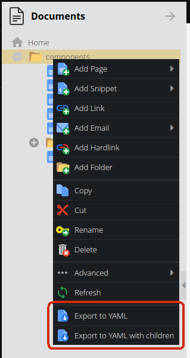
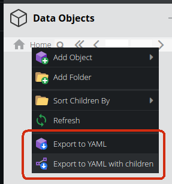
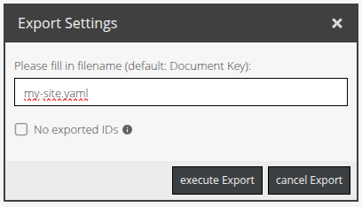

# Pimcore Import Export Bundle

## Installation

1.  **Require the bundle**
    
    ```shell
    composer require teamneusta/pimcore-import-export-bundle
    ```

2.  **Enable the bundle**
    
    Add the Bundle to your `config/bundles.php`:
    
    ```php
    Neusta\Pimcore\ImportExportBundle\NeustaPimcoreImportExportBundle::class => ['all' => true],
    ```

## Usage

### Pimcore Admin Backend

#### Export

After enabling the bundle you should see a new menu item in the context menu of Pimcore Admin Backend:

| Documents | Assets                                                                              | Data Objects                                                                    |
|--------|-------------------------------------------------------------------------------------|---------------------------------------------------------------------------------|
||  |  |

Currently only YAML Export is supported by menu

After clicking one of the menu items you will be asked for a file name and the export will start:



(german translation)

##### Special case: Assets Export

Because Assets are mostly assigned to physical files (images, videos, documents, etc.) the export will create a ZIP file containing the binary data and a YAML file with the metadata.
The same structured zip file can be used for the import of Assets as well.

#### Import
For the import you can have a look into the Tools Menu:


### Symfony Commands

This bundle provides several commands to export and import data into Pimcore.

Fur usage, run the commands with the `--help` option to see all available options and arguments.

- `neusta:pimcore:export:documents`
  - Export Pimcore documents (e.g., pages, snippets) to a YAML file. Export either the entire document tree or specific document IDs.
- `neusta:pimcore:export:assets`
  - Exports Pimcore assets (e.g., images, videos, PDFs) into two files: A YAML file along with a ZIP file containing the actual binary files.
  - Both files share the same base name (e.g., `assets.yaml` and `assets.zip`).
- `neusta:pimcore:export:objects`
  - Exports Pimcore DataObjects into a YAML file. The objects can be filtered by ID or exported in full.
- `neusta:pimcore:import:documents`
  - Imports Pimcore documents (e.g., pages, snippets) from a YAML file.
- `neusta:pimcore:import:assets`
  - Imports assets (e.g., images, PDFs, videos) into Pimcore based on a YAML definition.
  - The command expects a YAML file describing the assets and a ZIP archive containing the corresponding files. The ZIP file must be located in the same directory as the YAML file and must have the same base name (e.g., `assets.yaml` and `assets.zip`)
- `neusta:pimcore:import:objects`
  - Imports Pimcore DataObjects from a YAML file.

#### Common Options

All import commands follow a similar structure and support the following common options:

- `--input` or `-i`: Path to the input YAML file (required for import commands).
- `--dry-run`: Perform the operation without persisting data (only available for import commands).

### Notice: WYSIWYG - Editable

For using a correct exporting and importing of WYSIWYG editables in older Pimcore versions (e.g. using `symfony/framework < 6.2.2`) you probably need to configure your Symfony HTML sanitizer as documented here:
https://docs.pimcore.com/platform/2024.4/Pimcore/Documents/Editables/WYSIWYG#extending-symfony-html-sanitizer-configuration

In our integration test we have used the following configuration:

```yaml
tests/app/config/packages/pimcore.yaml
```
because of already known bugs with `<a>` - HTML tag.

## Concepts

### Page Export

The selected page will be exported into YAML format:

```yaml
elements:
    -
        Pimcore\Model\Document:
            id: 123
            parentId: 1
            type: page
            published: true
            path: /
            language: de
            navigation_name: my-site
            navigation_title: 'My Site'
            key: my-site
            title: 'My Site'
            controller: 'App\DefaultController::indexAction'
            editables:
                main:
                    type: areablock
                    name: main
                    data: [ { key: '1', type: text-editor, hidden: false } ]
# ...
```  

In the same way you can re-import your yaml file again by selecting: `Import from YAML` in the context menu.

### Page Import

The import process will create pages with the given data.

The following rule applies:

If the parseYaml method of the `PageImporter` is not called with `forcedSave`, the data from the provided YAML will be
adopted, regardless of whether it makes sense or not, and without checking whether the page could be saved that way.

 * If `forcedSave` is set to `true`, the ID will be retained (Caution – this can overwrite an existing page).
 * If `forcedSave` is set to `true` and no ID has been set, it will be generated by Pimcore (Creating new page).

 * If a `parentId` is specified, the corresponding document will be searched for.
 * If it exists, it will be set as the parent (Note: This may override the `path` specification).
 * If the `parentId` does not exist, an attempt will be made to find a parent using the `path` specification.
 * If such a parent exists, the `parentId` will be set accordingly and saved.
 * If neither is found, an InvalidArgumentException will be thrown, and the save operation will be aborted.


If multiple pages are imported and a path specification changes by the applied rules, this path specification will be
replaced with the new, correct path specification in all provided page configurations.

### Parameterize your yaml files

You can parameterize your yaml files with placeholders. The placeholders will be replaced by the values you provide in your fixtures.

```yaml
elements:
    -
        Pimcore\Model\Document:
            id: 2
            parentId: 1
            # ...further properties
            editables:
              # ...several editables
              'main:1.img:1.image':
                  type: image
                  data:
                      id: %IMAGE_ID%
              'main:1.img:1.title':
              # ...
```

In the case above an image has been assigned to an `Editable/Image` editable. The image id is a placeholder `%IMAGE_ID%`.

You can use now a `Neusta\Pimcore\ImportExportBundle\Documents\Import\Filter\SearchAndReplaceFilter` instance to replace the placeholder with the actual image id (e.g. 1234).

```php
$yamlContent = (new SearchAndReplaceFilter(['%IMAGE_ID%' => 1234]))->filterAndReplace($yamlContent);
```

If you want to change your yaml in a more complex way you can use the `Neusta\Pimcore\ImportExportBundle\Documents\Import\Filter\YamlFilter` interface to implement your own filter.

With that technique you can export test pages for Fixtures, change values into placeholders (e.g. for assets and data objects) and replace them with the actual values in your tests.


## Contribution

Feel free to open issues for any bug, feature request, or other ideas.

Please remember to create an issue before creating large pull requests.

### Local Development

To develop on your local machine, the vendor dependencies are required.

```shell
bin/composer install
```

We use composer scripts for our main quality tools. They can be executed via the `bin/composer` file as well.

```shell
bin/composer cs:fix
bin/composer phpstan
```

For the tests there is a different script, that includes a database setup.

```shell
bin/run-tests
```
