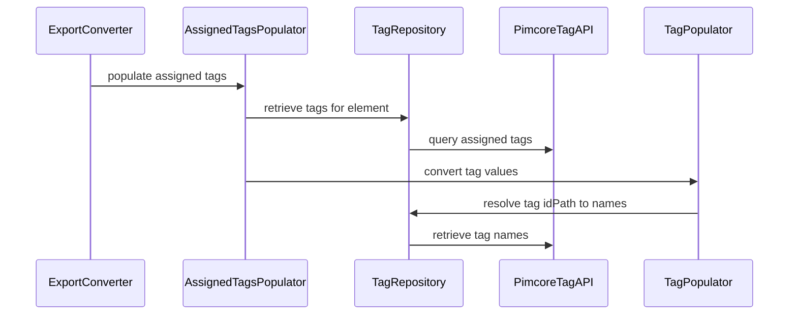

# Tags

## Export

Tags are exported when an element has assigned tags.

An additional section is added:

```yaml
# (tag section for the element, see exporter output snapshots)
```



## Import

- The importer supports assigning tags to Assets, Documents and DataObjects.
- Tag entries in the import YAML may contain either:
  - an `id` (numeric) — in which case the tag must already exist; or
  - a name-based path (e.g. `path` + `key`) — the importer will search for tags by their name path and create missing tags hierarchically.
- Behaviour:
  - If a tag is referenced by ID and does not exist, it cannot be assigned and the import will report the problem.
  - If a tag is referenced by name (path/key), the importer will try to find it via `TagRepository::getByPath()`; if not found it will create the required tag nodes and then assign them.
- Implementation notes:
  - Tag resolution and creation use the bundle’s `TagRepository`.
  - Assigned tags are registered during conversion (before the element has an ID) and are applied after the element is saved (via an import event subscriber), so the Pimcore element ID is available for assignment.
  - Import events (`Created`/`Updated`/`Failed`/`Inconsistency`) are dispatched to allow logging and error handling.

